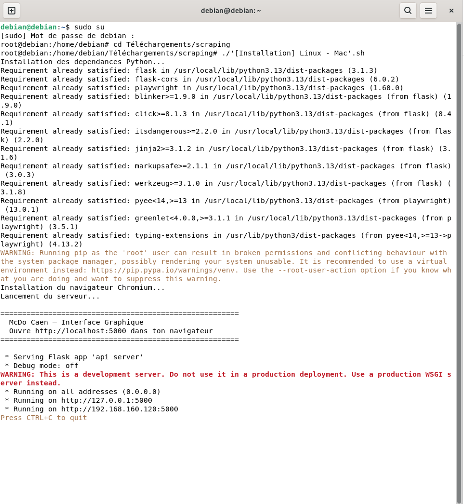
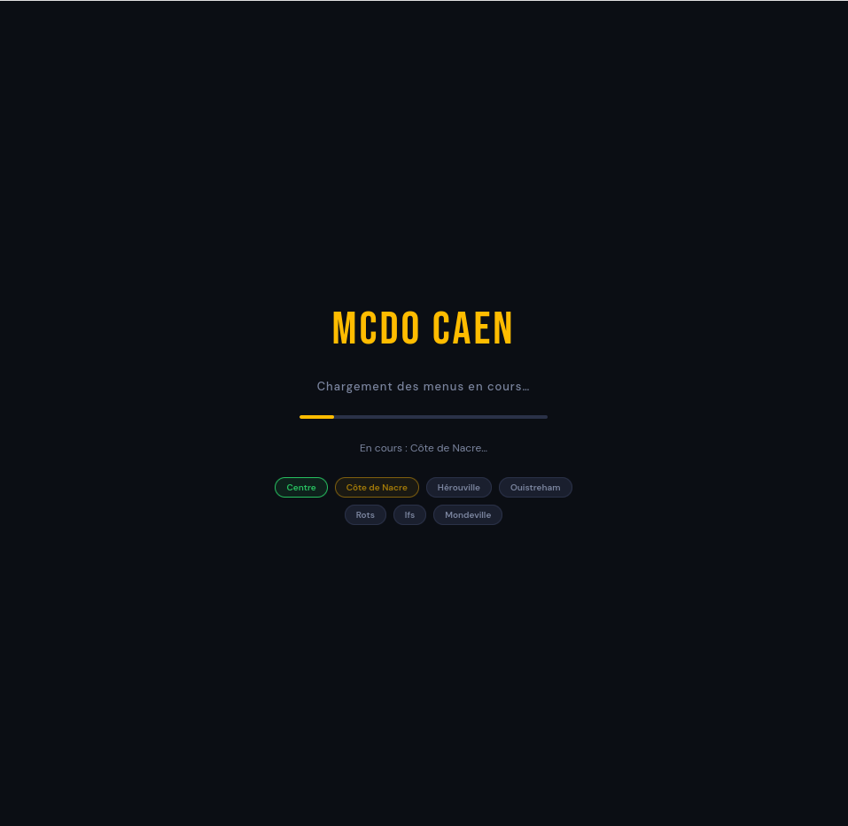
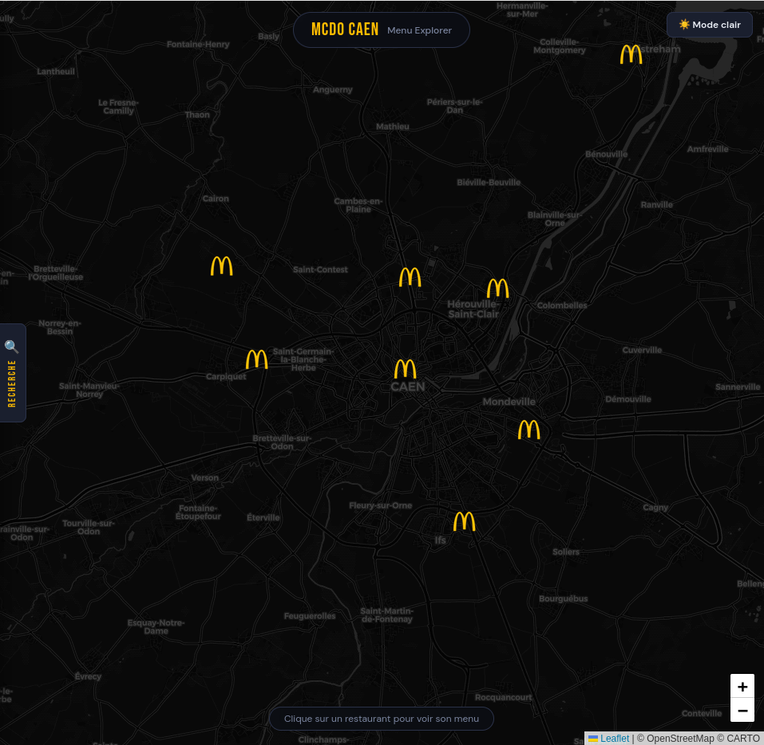
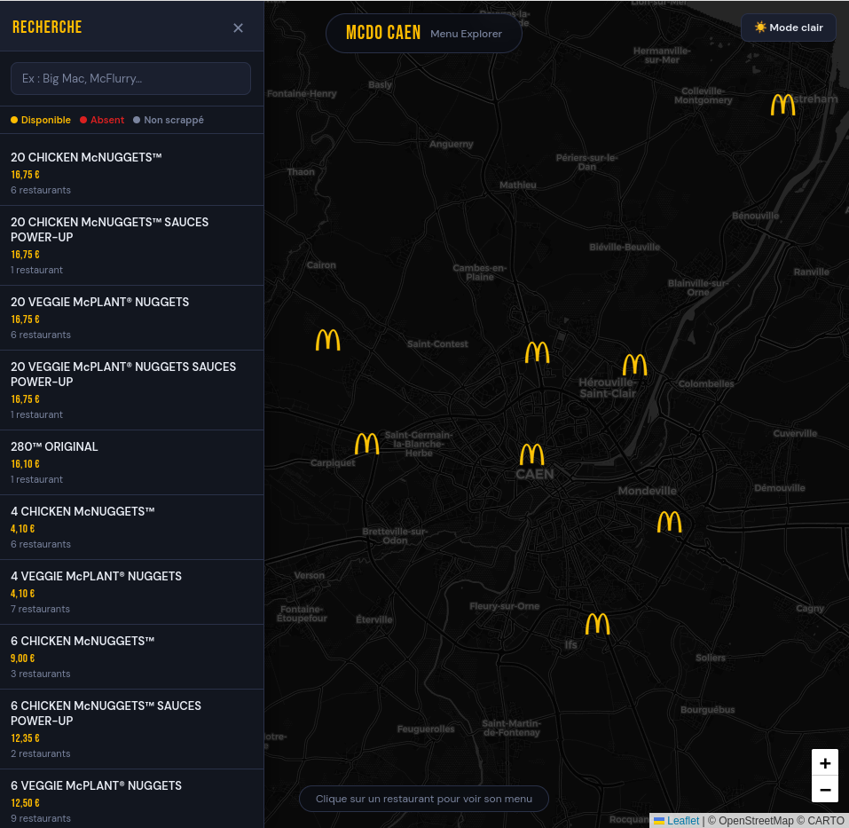
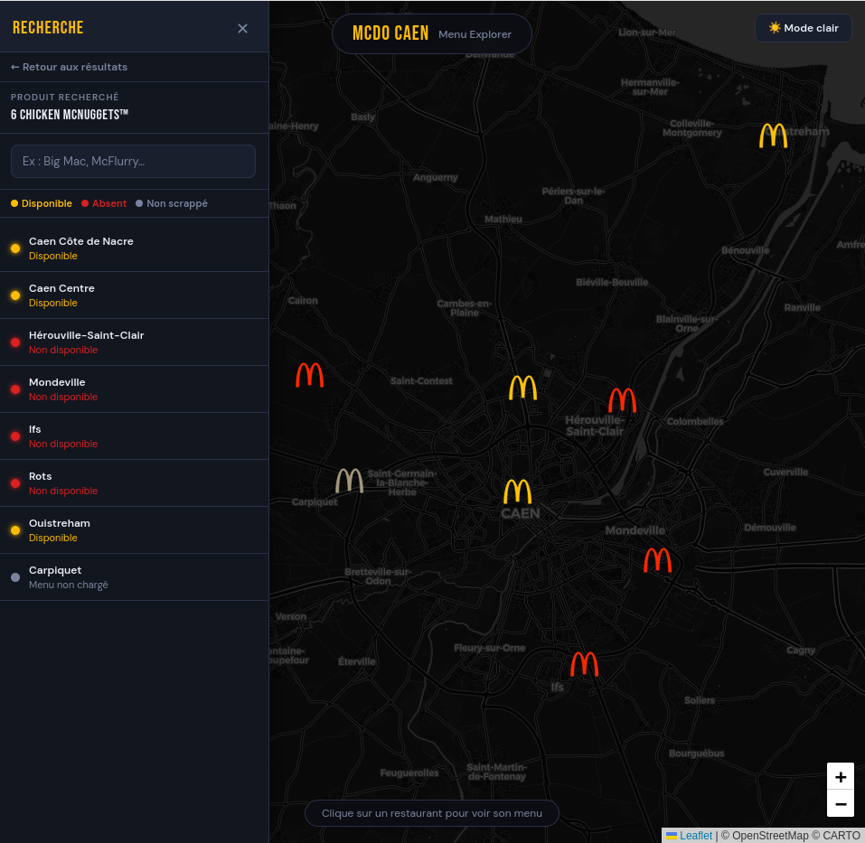
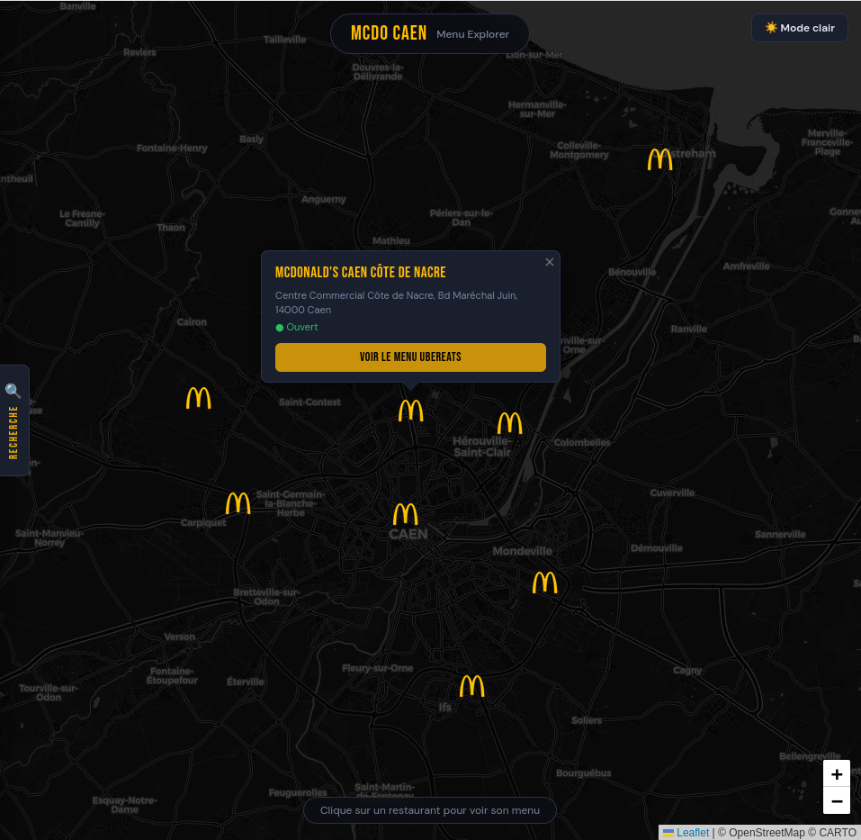
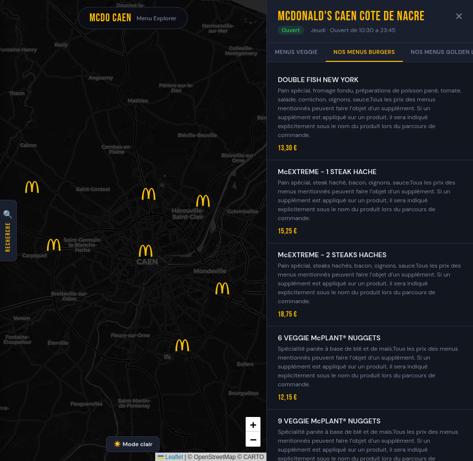

# 🍔 McDonald's Caen — Menu Explorer

Une interface web locale qui **scrappe en temps réel les menus UberEats** des McDonald's de l'agglomération caennaise et les affiche sur une carte interactive.

---

## 📸 Aperçu

### Chargement au démarrage
> Lancement de l'installation des dépendance nécessaire, après installation clique sur l'adresse IP:5000.



### Chargement au démarrage
> Tous les menus se chargent automatiquement au lancement, restaurant par restaurant.



### Carte interactive
> Vue d'ensemble des restaurants avec leurs statuts.



### Recherche cross-restaurants — liste des produits
> Après chargement, tous les produits de tous les restaurants sont consultables instantanément.



### Recherche cross-restaurants — disponibilité par restaurant
> En cliquant sur un produit, les marqueurs se colorent selon la disponibilité dans chaque restaurant.



### Popup restaurant
> Informations rapides et accès direct au menu depuis la carte.



### Panneau menu détaillé
> Navigation par catégories avec prix et ingrédients.



---

## ✨ Fonctionnalités

- **Carte interactive** (Leaflet + OpenStreetMap) avec tous les restaurants McDonald's de Caen et sa périphérie
- **Scraping automatique** des menus UberEats via Playwright (Chromium) avec contournement anti-bot
- **Chargement progressif au démarrage** : tous les menus se chargent en arrière-plan, restaurant par restaurant, avec barre de progression
- **Recherche cross-restaurants** : cherche un produit et vois instantanément dans quels restaurants il est disponible
  - 🟡 **Jaune** — produit disponible
  - 🔴 **Rouge** — produit absent du menu
  - ⚫ **Gris** — menu non encore chargé
- **Fenêtre navigateur minimisée automatiquement** après l'étape cookies/captcha (scraping en tâche de fond)
- **Mode clair / sombre**
- Affichage des **horaires du jour** pour chaque restaurant

---

## 🗺️ Restaurants couverts

| Restaurant | Disponible sur UberEats |
|---|:---:|
| McDonald's Caen Centre | ✅ |
| McDonald's Caen Côte de Nacre | ✅ |
| McDonald's Hérouville-Saint-Clair | ✅ |
| McDonald's Mondeville | ✅ |
| McDonald's Ifs | ✅ |
| McDonald's Rots | ✅ |
| McDonald's Ouistreham | ✅ |
| McDonald's Carpiquet | ❌ |

---

## 🛠️ Stack technique

| Composant | Technologie |
|---|---|
| Serveur web | Flask + Flask-CORS |
| Scraping navigateur | Playwright (Chromium, mode persistant) |
| Extraction DOM | JavaScript injecté via `page.evaluate()` |
| Carte | Leaflet.js + CartoDB tiles |
| Frontend | HTML / CSS / JS vanilla |
| Communication | API REST (polling `/scrape-all-status`) |

---

## 📦 Installation

### Prérequis

- Python 3.10+
- pip

### Étapes

```bash
# 1. Cloner le dépôt
git clone https://github.com/ayoubhry/mcdo-tracker.git
cd mcdo-tracker

# 2. Installer les dépendances Python
pip install flask flask-cors playwright

# 3. Installer Chromium via Playwright
playwright install chromium

# 4. Lancer le serveur
python api_server.py
```

Puis ouvrir **http://localhost:5000** dans ton navigateur.

> **Note :** Le scraping utilise un profil Chromium persistant (`uber_user_data/`) pour conserver les sessions. La première ouverture peut nécessiter de résoudre un captcha manuellement ; les suivantes sont généralement automatiques.

---

## 📁 Structure du projet

```
mcdo-caen/
├── api_server.py       # Serveur : Flask + endpoints scraping
├── browser.py          # Gestion Playwright (navigation, cookies, scroll, CDP)
├── js_scripts.py       # Scripts JS injectés (extraction menu & horaires)
├── display.py          # Fonctions d'affichage console
├── restaurants.json    # Données statiques des restaurants
├── index.html          # Interface web complète (carte + panneau + recherche)
├── mcdonalds.png           # Icône — ouvert
├── mcdonalds-closed.png    # Icône — fermé
└── mcdonalds-unavail.png   # Icône — indisponible / absent
```

---

## 🔌 API

| Méthode | Route | Description |
|---|---|---|
| `GET` | `/restaurants` | Liste des restaurants (restaurants.json) |
| `POST` | `/scrape` | Scrappe un restaurant `{ "store_id": "fr_caen_centre" }` |
| `POST` | `/scrape-all-start` | Démarre le scraping de tous les restaurants en arrière-plan |
| `GET` | `/scrape-all-status` | État du scraping global (polling) |

---

## ⚠️ Avertissement

Ce projet est un outil **personnel et éducatif**. Le scraping d'UberEats peut être contraire à leurs conditions d'utilisation. À utiliser de manière raisonnée et non commerciale.

---

## 📄 Licence

MIT
